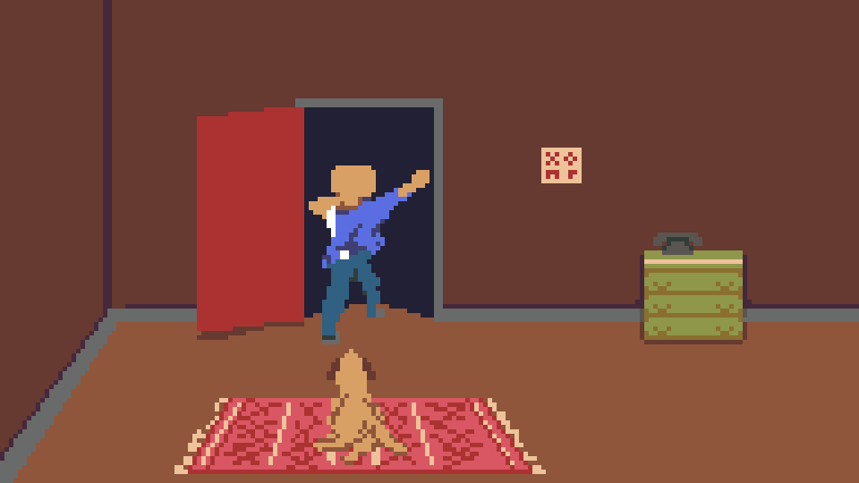
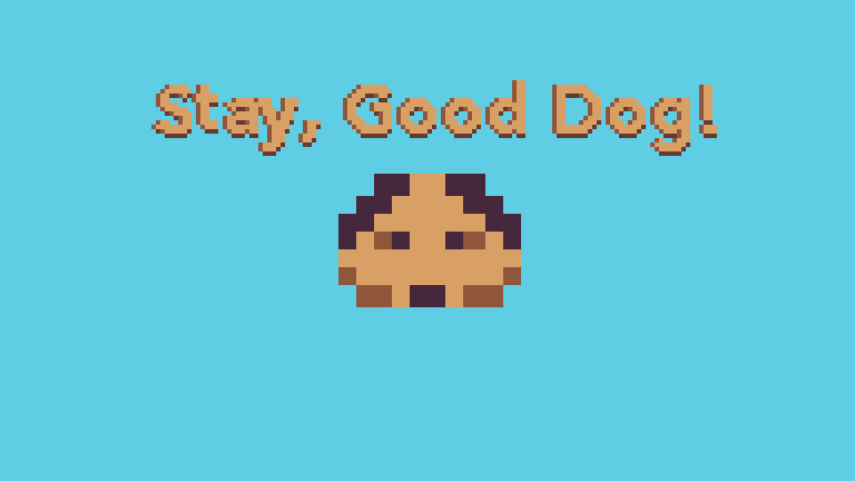

# Stay, Good Dog!
Stay, Good Dog! Is a video game that is all about a friendship between a dog and his owner. You play as the dog, and you must find your way back home to the arms of your owner.

Global Game Jam [link](https://globalgamejam.org/2019/games/stay-good-dog)

# Gameplay

# Credits
* Dylan Thomson - Project manager and Programmer
* Oskar Korošec - Programmer
* Prakash Prasad - Programmer
* Eskil Dahl Pettersen - Audio
* Oliver Getz Rodahl - Composer
* Maija Uleberg - 3D artist
* Terje Ballestad - 2D artist

